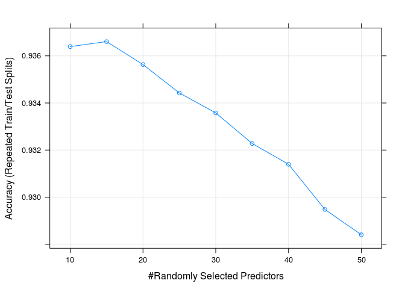
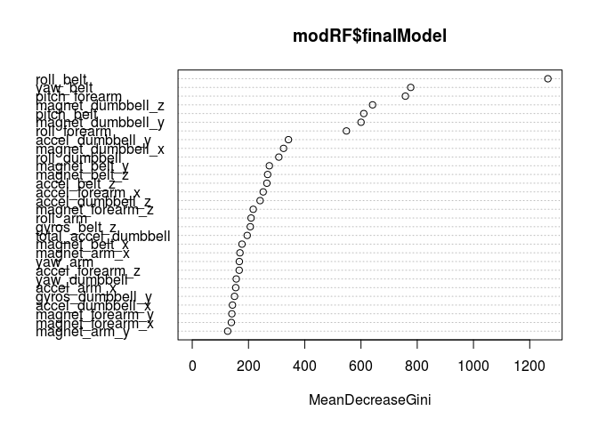
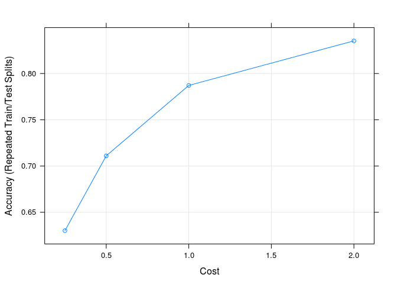
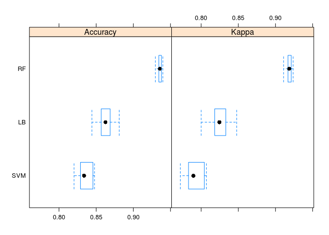

# Pratical Machine Learning Project
YJ  
18 Nov 2014  

## Getting data

The following code will get and read the data in R. The variable training and test are denoted to the respective data set.


```r
library(RCurl, quietly = T)
# reading training dataset
fp <- getURL("https://d396qusza40orc.cloudfront.net/predmachlearn/pml-training.csv")
dataset <- read.csv(text = fp)
# reading test dataset for submission
fp <- getURL("https://d396qusza40orc.cloudfront.net/predmachlearn/pml-testing.csv")
test <- read.csv(text = fp)
```

## Data Description and pre-modeling analysis

With the following summary statistics of the data set, we find that there is a lot of near zero or NA variables. So we will try to remove them before passing to modeling.


```r
dim(dataset)
```

```
## [1] 19622   160
```

```r
set.seed(12345)
# summary(dataset)
```
Here is the code to remove "kurtosis" and "skewness" statistics. We also remove the variables with NA percentage > 90%. The time-stamp and window variables are also removed due to inconsistency of analysis.


```r
# remove nearly empty and invalide var
ind_kurtosis <- grep("kurtosis",colnames(dataset))
ind_skewness <- grep("skewness",colnames(dataset))
# calculate the percentage of NA in each variable (threshold = 0.9)
sum(colMeans(is.na(dataset)) > 0.9)
```

```
## [1] 67
```

```r
ind_NA <- which(colMeans(is.na(dataset)) > 0.9)
ind_NA_test <- which(colMeans(is.na(test))==1)
## remove index var "X", timestamp var colnumber = 2,3,4,5
ind_remove <- unique(c(1:7, ind_kurtosis, ind_skewness, ind_NA, ind_NA_test))
forMLdat <- dataset[,-ind_remove]
dim(forMLdat)
```

```
## [1] 19622    53
```

```r
## turn classe into factor
forMLdat$classe <- factor(forMLdat$classe)
```

We have at last 52 variables.

## Dataset splitting

We split the data set into `training` and `testing` by 75% and 25%.


```r
# creating training/testing dataset for model building
library(caret)
```

```
## Loading required package: lattice
## Loading required package: ggplot2
```

```r
ind_train <- createDataPartition(forMLdat$classe, p=.75, list=FALSE, times=1)
training <- forMLdat[ind_train,]
testing <- forMLdat[-ind_train,]
```

We have 14718 training data set and 4904 testing data set.

## Principle Component Analysis (PCA)

We still have 52 variables. We could see if we can use PCA to reduce the number of predictors.


```r
preProcess(training[,-ncol(training)], method = "pca", thresh=0.95)
```

```
## 
## Call:
## preProcess.default(x = training[, -ncol(training)], method = "pca",
##  thresh = 0.95)
## 
## Created from 14718 samples and 52 variables
## Pre-processing: principal component signal extraction, scaled, centered 
## 
## PCA needed 24 components to capture 95 percent of the variance
```

```r
preProcess(training[,-ncol(training)], method = "pca", thresh=0.90)
```

```
## 
## Call:
## preProcess.default(x = training[, -ncol(training)], method = "pca",
##  thresh = 0.9)
## 
## Created from 14718 samples and 52 variables
## Pre-processing: principal component signal extraction, scaled, centered 
## 
## PCA needed 18 components to capture 90 percent of the variance
```

```r
preProcess(training[,-ncol(training)], method = "pca", thresh=0.85)
```

```
## 
## Call:
## preProcess.default(x = training[, -ncol(training)], method = "pca",
##  thresh = 0.85)
## 
## Created from 14718 samples and 52 variables
## Pre-processing: principal component signal extraction, scaled, centered 
## 
## PCA needed 15 components to capture 85 percent of the variance
```
We have seen that with PCA we can reduce the number of predictors by generating 25/18/15 components to capture 95%/90%/85% variance in the predictors.

## Data training with randomForest

First attempt with random Forest. By using `train` function in "caret" package, we by default train the data set with group-out cross validation with 10 times re-sampling and a 10% training set (around 1900 training samples each run). Because the random forest algorithm is not sensible to the scale of the variables, so non pre-processing is done for the training. 

`doMC` package is used for parallel computing.


```r
library(doMC)
registerDoMC(cores = 8)
trainCtr <- trainControl(
  method = "LGOCV",
  number = 10,
  p = 0.1)
modRF <- train(classe~., data=training, method="rf", trControl = trainCtr, tuneGrid = data.frame(mtry=seq(10, 50, by = 5)), quietly = T)
```

We use `tuneGrid` for tuning the parameter `mtry` from 10 to 50 with step 5. Below is the plot illustrate the Accuracy vs. mtry:

 

We also observe that in all of the 52 variables, only a few take an important role in the model:

 

The confusion matrix of training set has a pretty good result:


```
## Repeated Train/Test Splits Estimated (10 reps, 0.1%) Confusion Matrix 
## 
## (entries are percentages of table totals)
##  
##           Reference
## Prediction    A    B    C    D    E
##          A 27.9  1.2  0.0  0.1  0.0
##          B  0.2 17.1  0.9  0.1  0.2
##          C  0.1  0.9 16.2  1.2  0.4
##          D  0.2  0.1  0.3 14.9  0.2
##          E  0.0  0.0  0.0  0.1 17.5
```

By applying to reserved 25% testing set, we can assume that we have obtained a robust model:


```r
resPred <- predict(modRF, newdata = testing)
```

```
## Loading required package: randomForest
## randomForest 4.6-10
## Type rfNews() to see new features/changes/bug fixes.
```

```r
caret::confusionMatrix(resPred, testing$classe)
```

```
## Confusion Matrix and Statistics
## 
##           Reference
## Prediction    A    B    C    D    E
##          A 1395    7    0    0    0
##          B    0  937    2    0    0
##          C    0    5  851    6    1
##          D    0    0    2  798    4
##          E    0    0    0    0  896
## 
## Overall Statistics
##                                          
##                Accuracy : 0.9945         
##                  95% CI : (0.992, 0.9964)
##     No Information Rate : 0.2845         
##     P-Value [Acc > NIR] : < 2.2e-16      
##                                          
##                   Kappa : 0.993          
##  Mcnemar's Test P-Value : NA             
## 
## Statistics by Class:
## 
##                      Class: A Class: B Class: C Class: D Class: E
## Sensitivity            1.0000   0.9874   0.9953   0.9925   0.9945
## Specificity            0.9980   0.9995   0.9970   0.9985   1.0000
## Pos Pred Value         0.9950   0.9979   0.9861   0.9925   1.0000
## Neg Pred Value         1.0000   0.9970   0.9990   0.9985   0.9988
## Prevalence             0.2845   0.1935   0.1743   0.1639   0.1837
## Detection Rate         0.2845   0.1911   0.1735   0.1627   0.1827
## Detection Prevalence   0.2859   0.1915   0.1760   0.1639   0.1827
## Balanced Accuracy      0.9990   0.9934   0.9962   0.9955   0.9972
```

## Data training with boosted logistic regression (package `caTools`)

Now we passe to boosted logistic regression in caTools packages.


```r
registerDoMC(cores = 8)
trainCtr <- trainControl(
  method = "LGOCV",
  number = 10,
  p = 0.1)
modLB <- train(classe~., data = training, method = "LogitBoost", trControl = trainCtr, preprocess="pca")
```

```
## Loading required package: caTools
```

The confusion matrix on training set:


```
## Repeated Train/Test Splits Estimated (10 reps, 0.1%) Confusion Matrix 
## 
## (entries are percentages of table totals)
##  
##           Reference
## Prediction    A    B    C    D    E
##          A 28.4  1.8  0.4  0.6  0.3
##          B  0.7 14.5  1.1  0.3  0.8
##          C  0.5  1.3 13.8  1.1  0.6
##          D  0.6  0.5  0.9 13.6  0.8
##          E  0.2  0.4  0.2  0.5 16.0
```

The confusion matrix of the prediction in testing set:


```
## Loading required package: caTools
```

```
## Confusion Matrix and Statistics
## 
##           Reference
## Prediction    A    B    C    D    E
##          A 1303   85   11   16   10
##          B   15  667   58   12   29
##          C    6   42  624   59   31
##          D    6    4   22  552   25
##          E    2   16    5   11  709
## 
## Overall Statistics
##                                           
##                Accuracy : 0.8924          
##                  95% CI : (0.8827, 0.9015)
##     No Information Rate : 0.3083          
##     P-Value [Acc > NIR] : < 2.2e-16       
##                                           
##                   Kappa : 0.8623          
##  Mcnemar's Test P-Value : < 2.2e-16       
## 
## Statistics by Class:
## 
##                      Class: A Class: B Class: C Class: D Class: E
## Sensitivity            0.9782   0.8194   0.8667   0.8492   0.8818
## Specificity            0.9592   0.9675   0.9617   0.9845   0.9903
## Pos Pred Value         0.9144   0.8540   0.8189   0.9064   0.9542
## Neg Pred Value         0.9900   0.9585   0.9730   0.9736   0.9734
## Prevalence             0.3083   0.1884   0.1667   0.1505   0.1861
## Detection Rate         0.3016   0.1544   0.1444   0.1278   0.1641
## Detection Prevalence   0.3299   0.1808   0.1764   0.1410   0.1720
## Balanced Accuracy      0.9687   0.8934   0.9142   0.9168   0.9361
```

## Training with support vector machine with radial kernel

The support vector machine can also provide a computational light algorithm and a good performance.


```r
trainCtr <- trainControl(
  method = "LGOCV",
  number = 10,
  p = 0.1)
modSVM <- train(classe~., data = training, method ="svmRadial", preProc = c("center", "scale"), trControl = trainCtr, tuneLength =4)
```

```
## Loading required package: kernlab
```

```r
plot(modSVM)
```

 

The confusion matrix of training set:


```
## Loading required package: kernlab
```

```
## Repeated Train/Test Splits Estimated (10 reps, 0.1%) Confusion Matrix 
## 
## (entries are percentages of table totals)
##  
##           Reference
## Prediction    A    B    C    D    E
##          A 26.4  2.3  0.9  0.5  0.3
##          B  0.3 14.9  1.3  0.2  1.0
##          C  0.7  1.4 14.0  2.0  1.3
##          D  0.9  0.3  1.0 13.4  0.9
##          E  0.1  0.4  0.3  0.3 14.9
```

The confusion matrix of prediction and true value of testing set:


```
## Confusion Matrix and Statistics
## 
##           Reference
## Prediction    A    B    C    D    E
##          A 1390   68    1    2    0
##          B    2  856   17    1    2
##          C    3   24  832   65   25
##          D    0    0    5  735   22
##          E    0    1    0    1  852
## 
## Overall Statistics
##                                           
##                Accuracy : 0.9513          
##                  95% CI : (0.9449, 0.9571)
##     No Information Rate : 0.2845          
##     P-Value [Acc > NIR] : < 2.2e-16       
##                                           
##                   Kappa : 0.9383          
##  Mcnemar's Test P-Value : NA              
## 
## Statistics by Class:
## 
##                      Class: A Class: B Class: C Class: D Class: E
## Sensitivity            0.9964   0.9020   0.9731   0.9142   0.9456
## Specificity            0.9798   0.9944   0.9711   0.9934   0.9995
## Pos Pred Value         0.9514   0.9749   0.8767   0.9646   0.9977
## Neg Pred Value         0.9985   0.9769   0.9942   0.9833   0.9879
## Prevalence             0.2845   0.1935   0.1743   0.1639   0.1837
## Detection Rate         0.2834   0.1746   0.1697   0.1499   0.1737
## Detection Prevalence   0.2979   0.1790   0.1935   0.1554   0.1741
## Balanced Accuracy      0.9881   0.9482   0.9721   0.9538   0.9726
```

## Comparaison of Fitted models

By comparing three models with their accuracy and kappa (for performance metric), we could conclude that the `random forest` has the best accuracy and performance.

 


## Predicting "test" data set and output for Programming Validation

We use the following function provided by the course to produce the files for submission.


```r
out <- predict(modRF, newdata = test)

pml_write_files = function(x){
  n = length(x)
  for(i in 1:n){
    filename = paste0("submission/problem_id_",i,".txt")
    write.table(x[i],file=filename,quote=FALSE,row.names=FALSE,col.names=FALSE)
  }
}
pml_write_files(out)
```

